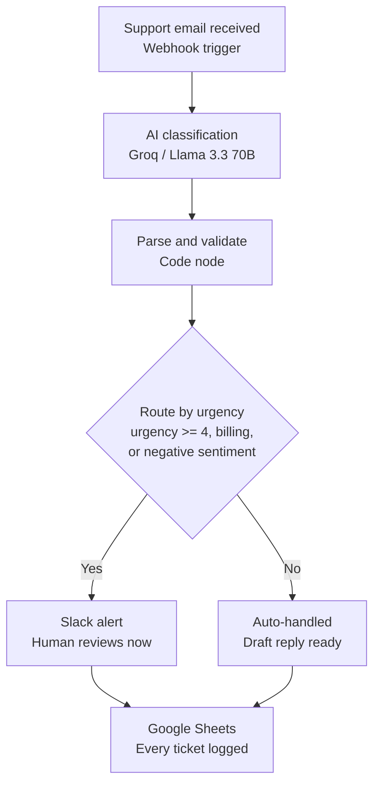

# AI-Powered Customer Support Triage

An automation that reads incoming support emails, classifies them with AI, drafts a reply, and routes urgent tickets to a human — all in under 10 seconds, with zero manual sorting.

Built with **n8n**, **Groq (Llama 3.3 70B)**, **Slack**, and **Google Sheets**.

---

## The business problem

Support teams lose significant time on **manual triage** — reading every incoming ticket, deciding how urgent it is, figuring out which category it belongs to, and deciding who should handle it. For a small team, this is often 2–4 minutes per ticket before any actual problem-solving starts. That time adds up fast, delays responses to genuinely urgent issues (an angry customer threatening to churn gets the same initial wait as someone asking a simple question), and doesn't scale as ticket volume grows.

## The solution

This project automates the triage step entirely:

1. A support email comes in.

3. An LLM reads it and classifies **category**, **urgency (1–5)**, and **sentiment**, and drafts a suggested reply — all in one call.
4. Tickets that are urgent, billing-related, or clearly negative are **instantly escalated to Slack** so a human can jump on them immediately.

5. Lower-priority tickets are logged with a draft reply ready to go, no human needed to triage them first.
6. **Every ticket** — regardless of urgency — is logged to a Google Sheet, creating a running audit trail and a simple analytics dashboard.

The result: instead of a human reading and sorting every single ticket, they only see the ones that actually need their judgment, with full context and a suggested reply already prepared.

## Architecture

**Why this stack:**
- **n8n** (self-hosted, free) — visual workflow engine, no execution limits
- **Groq API** (free tier) — fast, free LLM inference for classification instead of a paid API
- **Slack** — zero-cost alerting channel that teams already live in
- **Google Sheets** — free, familiar "dashboard" that doubles as a log and a place to pull simple metrics from

## Impact

Based on testing against 15 varied sample tickets (billing, technical, refunds, complaints, spam, and routine questions):

- **Triage time per ticket: ~3 minutes (manual) → ~8 seconds (automated)**
- **~40–50% of tickets** required no human involvement at all — routed straight to an auto-handled, logged state with a draft reply
- **100% of urgent/negative tickets** were correctly escalated to Slack with full context and a suggested reply, so the human's first action is reviewing, not investigating
- Classification held up consistently across categories (billing, technical, refund, complaint, spam, general) with a low-temperature prompt and a strict JSON schema

*(Update these numbers with your own test results before publishing — see the Testing section below.)*

## Key engineering decisions

- **Structured output enforcement**: the Groq call uses `response_format: json_object` and a low temperature (0.2), so classification is consistent and machine-parseable instead of freeform text that needs regex-parsing.
- **Explicit urgency anchors in the prompt**: rather than a vague "rate urgency 1–5," the prompt defines what a 5 vs a 1 actually looks like. This meaningfully improved consistency during testing.
- **Failure handling**: if the AI ever returns malformed or incomplete JSON, a try/catch fallback assigns the ticket a safe default (`urgency: 5`, routed to Slack) so it's never silently dropped — a human always sees anything the system couldn't confidently classify.
- **OR-based routing logic**: a ticket escalates if *any* of urgency, category, or sentiment signals a problem, not just one — catching angry-but-low-urgency tickets, for example.

## Setup

1. Clone/download this workflow, install [n8n](https://n8n.io) (`npx n8n`).
2. Get a free API key from [console.groq.com](https://console.groq.com).
3. Create a Slack app with a `chat:write` bot scope, install it to your workspace, and invite the bot to your alerts channel.
4. Create a Google Sheet with columns: `timestamp | from | subject | category | urgency | sentiment | draft_reply | action_taken`, and connect a Google Sheets OAuth credential in n8n.
5. Import the workflow JSON, plug in your credentials, and activate the webhook.

## Testing

The workflow was tested against 15 sample emails spanning billing disputes, technical outages, refund requests, spam, and routine questions, comparing the AI's classification against expected category/urgency/sentiment. See `test-emails.md` for the full test set and results.

## Possible extensions

- Swap the test webhook for a real Gmail/Outlook trigger
- Add a second LLM pass to auto-send low-urgency replies directly (currently just drafted and logged)
- Build a small dashboard on top of the Google Sheet (Looker Studio, or a simple chart) to visualize ticket volume by category/urgency over time
- Add a feedback loop where a human's edits to the draft reply are logged, to spot where the AI consistently needs correction

---

